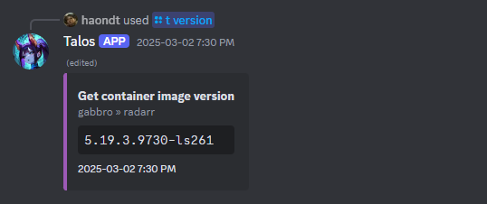
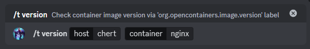
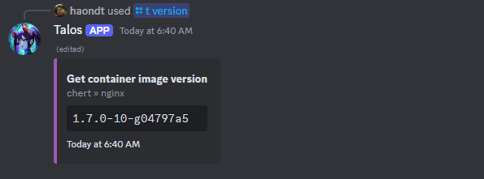
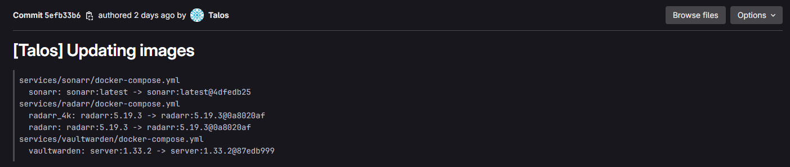
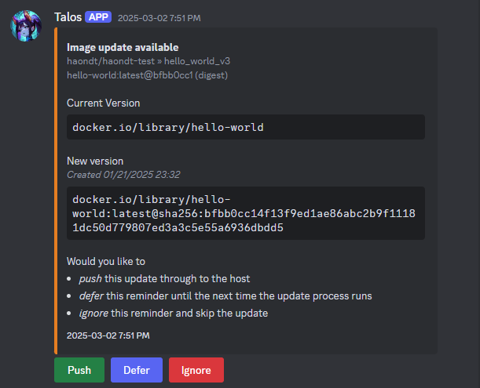
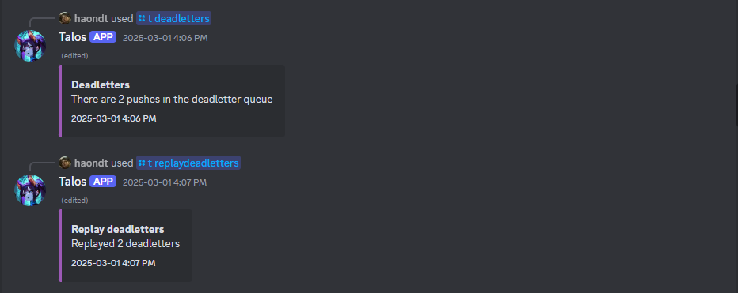
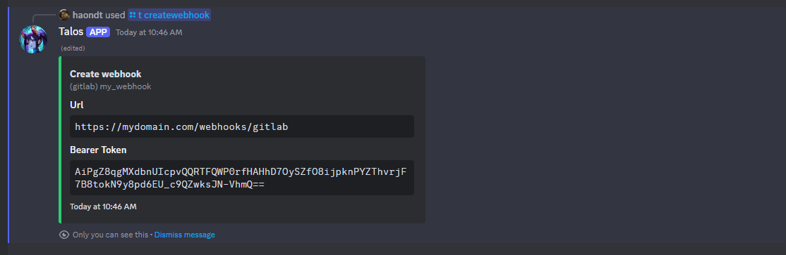
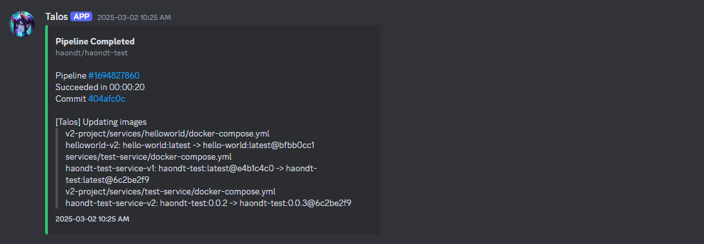
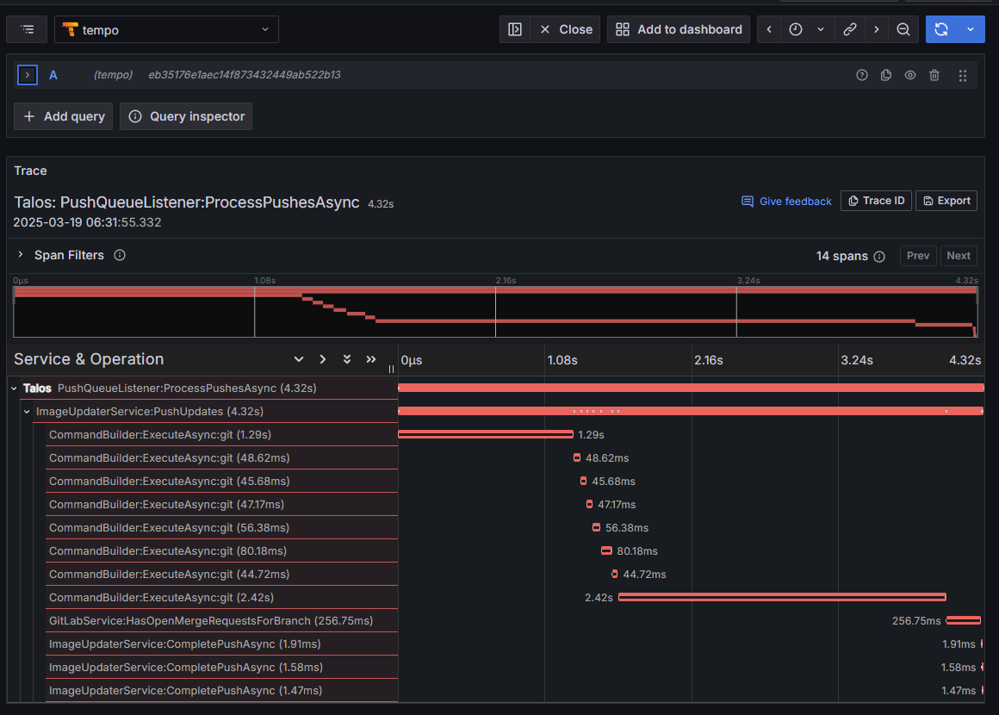
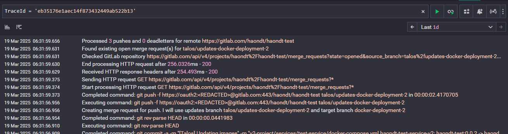

# Talos

A Discord bot for managing Docker containers on my home server.

## Deployment

Talos wraps a few command-line tools that must be installed on the host system:

- [`docker`](https://docs.docker.com/reference/cli/docker/)
- [`skopeo`](https://github.com/containers/skopeo)
- [`git`](https://git-scm.com/)

The easiest way to run Talos is with the Docker image, which has these utilities pre-installed.
Talos also requires a Redis instance for caching, so the recommended way to get up and running is with Docker Compose.

```yml
services:
  talos:
    image: registry.gitlab.com/haondt/cicd/registry/talos:latest
    user: talos
    group_add:
      - 1234 # talos needs to be part of the docker group
    networks:
      - talos
    volumes:
      - /var/run/docker.sock:/var/run/docker.sock:ro
    environment:
      RedisSettings__Endpoint: talos-redis:6379
      DiscordSettings__BotToken: your-bot-token
      DiscordSettings__GuildId: 1234
      DiscordSettings__ChannelId: 1234
  talos-redis:
    networks:
      - talos
    image: redis

networks:
  talos:
```

## Features & Configuration

Talos is configured using .NET appsettings, meaning it can be configured through environment variables or by mounting an `appsettings.Production.json`
in the `/app` directory.

### Discord Integration

Talos uses Discord as a frontend. It will respond to slash commands and send notifications.
Talos will only work in the provided guild and will default to the provided channel for messaging.

```json
{
  "DiscordSettings": {
    "BotToken": "your-bot-token",
    "GuildId": 1234567890,
    "ChannelId": 1234567890
  }
}
```

<div align="center">
    
</div>

### Docker

Talos can connect to Docker hosts both locally and remotely to run Docker operations.
For local hosts, simply add an entry in the `DockerSettings` with the Docker version.

The version sets which `compose` command Talos will use, i.e., V1 = `docker-compose`, V2 = `docker compose`.

```json
{
  "DockerSettings": {
    "Hosts": {
      "localhost": {
        "DockerVersion": "V2"
      }
    }
  }
}
```

With this, Talos can execute commands on the host.

<div align="center">
    
</div>
<div align="center">
    
</div>

#### Remote Hosts

Talos also supports remote hosts over SSH, using an identity file for authentication.

```json
{
  "DockerSettings": {
    "Hosts": {
      "remote_machine": {
        "DockerVersion": "V2",
        "SSHConfig": {
          "Host": "163.174.249.51",
          "User": "talos",
          "IdentityFile": "/config/id_rsa"
        }
      }
    }
  }
}
```

> [!IMPORTANT]
> Talos runs as the `talos` user in its container and uses the configured user on remote hosts.
> This user must exist on the host and must belong to the Docker group for Talos to run Docker commands.

### Image Updating

Talos can automatically update Docker images in an IaC repository, similar to [Renovate](https://www.mend.io/renovate/).
To configure it, you must first tell Talos how often to run scans and what repositories to connect to.

```json
{
  "ImageUpdateSettings": {
    "Schedule": {
      "Type": "Delay",
      "DelaySeconds": 3600 // every hour
    }
  }
}
```

Each repository references a host, which provides info on how to connect and authenticate with it.

```json
{
    "ImageUpdateSettings": {
        "Hosts": {
            "gitlab": {
                "Type": "GitLab",
                "Name": "oauth2", // username
                "Token": "glpt-abcabcabc", // personal access token
                "Email": "talos@example.com" // email for the commits
            }
        },
        "Repositories": [
            {
                "Url": "https://gitlab.com/haondt/my-repository",
                "Host": "gitlab", // references Hosts section
                "Branch": "main",
                "Glob": { // globs of files to watch
                    "DockerCompose": {
                        "IncludeGlobs": [
                            "docker-compose.yml",
                            "docker-compose.*.yml"
                        ]
                    },
                    "Dockerfile": {
                        "IncludeGlobs": [
                            "Dockerfile",
                            "*.Dockerfile"
                        ]
                    },
                    "Yaml": {
                        "IncludeGlobs": [
                            "deployment.yaml"
                        ],
                        "AncestorPath": "/spec/template/",
                        "RelativeImagePath": "/spec/containers/0/image",
                        "RelativeTalosPath": "/metadata/annotations/haondt.dev\\/talos"
                    }
                }
                "CooldownSeconds": 300
            }
        ]
    }
}
```

> [!NOTE]
> The idea here is that Talos will commit to a repository, then a deployment pipeline takes over to push the update.
> To avoid triggering too many pipelines at once, Talos allows a per-repository cooldown period.
> After making a change, future updates will be queued until this cooldown expires.

Talos checks for image updates and commits the change to the repository with a message detailing the changes.

<div align="center">
    
</div>

#### Registry Throttling

Some container registries have limits on how often you can pull from them. Talos can enforce these limits to prevent excessive pulls.

```json
{
  "UpdateThrottlingSettings": {
    "Domains": {
      "docker.io": {
        "Limit": 5,
        "Per": "Hour"
      }
    }
  }
}
```

#### Opting In

Talos can manage both docker compose files and dockerfiles. An image in either file must opt-in in order to be manages by Talos.

To opt in a docker compose image, the service must have an `x-talos` extension.

```yml
services:
  helloworld:
    image: hello-world
    x-talos:
      bump: minor
      strategy:
        digest: push
```

To opt in a dockerfile, the image must have a comment underneath it that begins with `!talos`. The configuration is made up of space-delimited key-value pairs, and one or more `!talos` comments can be added for a single image.

```dockerfile
FROM hello-world
# !talos skip=false bump=minor
# !talos strategy.digest=push
```

Both are compatible with the "short form" (explained below), using `x-tl:` as the docker compose extension and `!tl` as the dockerfile prefix.

#### Yaml File

One of the options for configuration is just arbitrary yaml files. It has the following configuration options:

- `IncludeGlobs`: `list[str]`
  - which file globs to include
- `ExcludeGlobs`: `list[str]`
  - which file globs to exclude
- `AncestorPath`: `str`
  - Path to the "root" object that should be updated. Whatever this returns will be considered a single update target. This is a yaml path, and is interpreted by the YamlPathForYamlDotNet library. You can refer to their [documentation](https://github.com/gfs/YamlPathForYamlDotNet) for syntax. This path may use wildcards or other features to return many objects from a single file.
- `RelativeImagePath`: `str`
  - This should give the path to the image string Talos should update, relative to the `AncestorPath`
- `RelativeTalosPath`: `str`
  - This should give the path to the Talos configuration, relative to the `AncestorPath`. This can either be an object or a string, and Talos will automatically parse it in the full or short forms accordingly.

#### Update Strategy

The update strategy is configured per container in the Docker Compose file.

```yml
services:
  helloworld:
    image: hello-world
    x-talos:
      skip: false
      bump: minor
      strategy:
        digest: push
        patch: push
        minor: prompt
        major: skip
```

Talos looks for the `x-talos` extension for update rules. If `skip: true`, Talos ignores this container.

The `strategy` section defines how to handle updates of different sizes:

- `digest`: when a tag has the same name but the digest has been updated. For named tags (e.g. `latest`), the update is always `digest`.
- `patch`, `minor`, `major`: Correspond to semantic versioning updates.

Each update **size** is mapped to a **strategy**:

- `push`: Push the change directly to the branch.
- `prompt`: Send a Discord notification asking for confirmation.
- `notify`: Send a Discord notification about the new version.
- `skip`: Ignore the new version entirely.

The `bump` setting defines the maximum update size. For example, if an image is at `v1.2.3`, Talos will update to `v1.3.0` only if `bump` is `minor` or higher.
Additionally, Talos will only consider tags with the same number of semantic segments.
So `v1.2.3` can be bumped to `v1.3.0`, but not to `v1.3`.

<div align="center">
    
</div>

#### Image Synchronization

Talos can keep two or more image versions in sync. This means they will be made to always have the same version, and if a particular version update is available for one but not the other, Talos will hold off until they can both be updated. Additionally, the updates will be applied atomically, so Talos will wait until there is a suitable gap in the throttling mechanisms large enough to allow for all the synced images to be updated together.

To synchronize a group of images, each image in the group will need the `sync.id`, `sync.role` and `sync.group` attributes. The `group` identifies the sync group, the `id` identifies the images identity relative to the group and the `role` identifies the images role in the group, either `parent` or `child`. A group must have exactly one parent, as the parent will define the update strategy for the entire group.

The parent may optionally also add a `children` attribute, which lists out all the children that should be part of the group. Talos will refuse to update the group unless it can successfully find both the parent and all the expected members of the group.

Lastly, the parent may also specify the optional attribute `digest`. If set to true, Talos will synchronize both the image tag and the digest, otherwise it will only look at the tag and consider all digests as valid.

```yml
services:
  immich-server:
    image: ghcr.io/immich-app/immich-server:v1.128.0
    x-talos:
      skip: false
      bump: Major
      strategy:
        digest: Skip
        patch: Push
        minor: Push
        major: Prompt
      sync:
        role: parent
        group: immich
        id: server
        children: [ml]
        digest: false
  immich-machine-learning:
    image: ghcr.io/immich-app/immich-machine-learning:v1.128.0
    x-talos:
      skip: false
      sync:
        role: child
        group: immich
        id: ml
```

#### Compact Form

Talos supports a compact notation using `x-tl` for update strategies.
This extension accpets a single string in the format `<bump>:<strategies>`, where:

- `x` alone skips updates.
- The first character defines the bump size (`+`, `^`, `~`, `@` for `major`, `minor`, `patch`, `digest`).
- If no second character is present, `notify` is used for all updates.
- If the second character is a strategy, it defines the strategy for all update types.
- The strategies are represented as `*`, `?`, `.`, `!` for `notify`, `prompt`, `skip`, `push`.
- If the second character is a colon (`:`), the following characters specify the strategies for `digest`, `patch`, `minor`, and `major` (missing values default to `prompt`).

Full example:

```yml
services:
  helloworld:
    image: hello-world
    x-tl: ^:!!?.
```

Other examples:

```yml
x-tl: x # skip
x-tl: ~  # bump up to patch, all notify
x-tl: +! # bump up to major, all push
x-tl: ^? # bump up to minor, all prompt
x-tl: ~:!? # bump up to patch, digest -> push, patch -> prompt
x-tl: @:!!!! # bump up to digest, all push (although since we have bump:digest everything above digest is ignored)
x-tl: +:! # bump up to major, digest -> push, others default to notify
```

### Dead Lettering

When Talos determines an image can be updated, it places the update in a queue. A seperate process watches the queue
and determines what can be pushed based on the throttling and cooldown settings. If a push fails, it is placed in a dead letter queue.
On the next run, if the main process notices its update was not pushed through, it will requeue it and the second process will retry
it when possible.

This whole process is automatic, you don't have to manage anything here. It's just useful
if you want to examine the dead letter queue or replay dead letters ahead of schedule.
Both queues are idempotent and Talos will never push an image downgrade, even when replaying an old dead letter.

<div align="center">
    
</div>

### Webhooks

After pushing an update, Talos can listen for pipeline events and notify the Discord channel when a pipeline completes.
It will only consider pipelines that reference one of its commits.

The only required configuration is the base URL for webhook generation.

```json
{
  "ApiSettings": {
    "BaseUrl": "https://mydomain.com"
  }
}
```

<div align="center">
    
</div>

<div align="center">
    
</div>

## Tracing

Talos provides logs in structured json format and can optionally emit traces using OpenTelemetry.
To use message tracing, enable it and configure the OpenTelemetry endpoint.

```json
{
  "TracingSettings": {
    "Enabled": true,
    "Endpoint": "http://localhost:4317",
    "Protocol": "Grpc",
    "IncludeTraceLibraries": {
      "StackExchange.Redis": false
    }
  }
}
```

Logs will be enriched with a `TraceId` that can be used for correlation.

<div align="center">
    
</div>

<div align="center">
    
</div>
